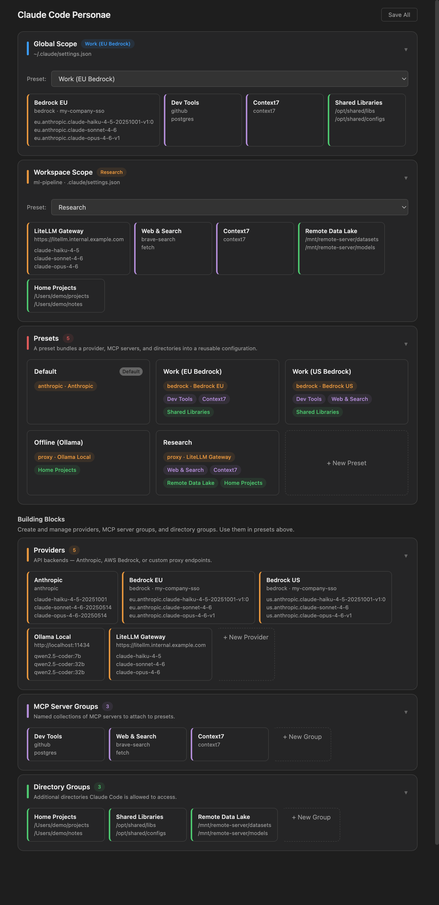

# Claude Code Settings

A VS Code extension for managing [Claude Code](https://docs.anthropic.com/en/docs/claude-code) configurations through composable, reusable presets.



## Concept

Instead of editing JSON files by hand, this extension lets you build **presets** from three types of building blocks:

- **Providers** — API backends: Anthropic Direct, AWS Bedrock, or any OpenAI-compatible proxy (Ollama, vLLM, LM Studio, LiteLLM, …)
- **MCP Server Groups** — named collections of MCP servers
- **Directory Groups** — additional directories Claude Code may access

A **preset** bundles one provider + any number of MCP server groups + any number of directory groups into a single switchable configuration.

Presets are then assigned to **scopes**:

| Scope | Config files written | Dropdown options |
|---|---|---|
| **Global** | `~/.claude/settings.json`, `~/.claude.json` | Any preset, or Manual |
| **Workspace** | `{workspace}/.claude/settings.json`, `.mcp.json` | Any preset, Inherit from Global, or Manual |

Switching a scope's preset instantly reconfigures Claude Code — no manual file editing required.

## Storage

All building blocks, presets, and scope assignments are stored in a single file:

```
~/.claude/coder-profiles.json
```

On **Save All**, the extension resolves the active presets and writes the resulting flat configuration into Claude Code's own files. When a workspace scope is set to **Inherit from Global**, any previously written workspace-level settings are cleaned up automatically.

A sample configuration is included in [`examples/coder-profiles.json`](examples/coder-profiles.json).

## Getting Started

1. Open the Command Palette → **Open Claude Code Settings**
2. Create a **Provider** (e.g. AWS Bedrock with your profile and region)
3. Optionally create **MCP Server Groups** and **Directory Groups**
4. Create a **Preset** that combines your provider with any groups
5. Assign the preset to the **Global** or **Workspace** scope
6. Click **Save All**

### AWS Bedrock

- Select provider type **Bedrock**, fill in your AWS profile name and region
- Pick models for each tier — cross-region inference profiles are recommended
- Optionally set an auth-refresh command (e.g. `aws sso login --profile my-profile`)
- Claude Code's login/logout commands are automatically disabled when using Bedrock

### Local / Compatible API (Ollama, vLLM, LM Studio, …)

- Select provider type **Proxy**, enter the base URL (e.g. `http://localhost:11434`)
- Click **Fetch available models** to discover models from `/v1/models`
  - Single-model endpoints auto-select the model for all tiers
  - Multi-model endpoints show a dropdown to pick per tier
- You can also type a model ID manually if the endpoint does not expose `/v1/models`
- Set an API Key to any non-empty value (e.g. `local`) if Claude Code prompts for login — the proxy handles authentication, not Anthropic

### Anthropic Direct

- The built-in **Anthropic** provider is always available
- Optionally set your API key in the provider editor
- Model selection is not shown — Claude Code uses its built-in defaults (Sonnet for primary, Haiku for small/fast tasks, Opus for complex tasks)

## Features

| Feature | Detail |
|---|---|
| Composable presets | Mix and match providers, MCP servers, and directories |
| Scope management | Global and per-workspace configurations with inheritance |
| Provider types | Anthropic Direct, AWS Bedrock, OpenAI-compatible proxy |
| MCP server groups | Reusable named collections of MCP servers (stdio, HTTP, SSE) |
| Directory groups | Additional directories Claude Code may access |
| Live model discovery | Fetch available models button queries `/v1/models` from proxy servers; auto-selects single-model endpoints |
| Dirty indicator | Title bar shows `●` when unsaved changes exist |
| Drawer-based editing | Slide-out panels for editing all building blocks |
| Inherit mode | Workspace scope can inherit from global — cleans up workspace files |
| Login prompt suppression | Save All writes `hasCompletedOnboarding` to `~/.claude.json`; optional "Disable non-essential traffic" toggle per provider |

## Requirements

- VS Code 1.98 or later
- For Bedrock: AWS CLI configured with a named profile (`aws configure --profile <name>`)
- For Proxy: a running OpenAI-compatible server

## Extension Settings

This extension does not add VS Code settings. All configuration is managed through `~/.claude/coder-profiles.json` and resolved into Claude Code's own files on save.

## Release Notes

See [CHANGELOG.md](CHANGELOG.md).
