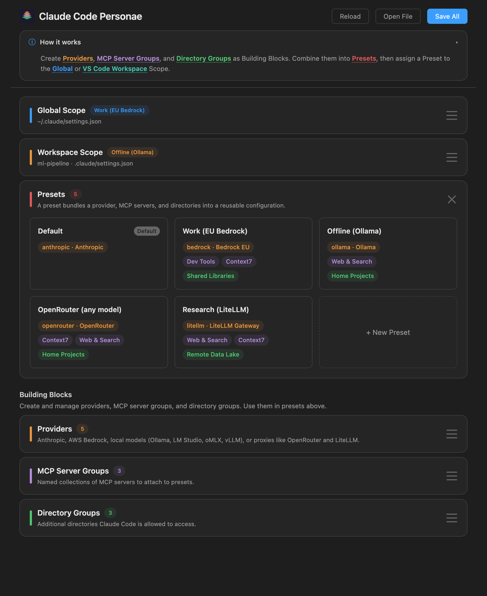

# Claude Code Personae

**One Claude Code. Every backend.** Point [Claude Code](https://docs.anthropic.com/en/docs/claude-code) at Anthropic, AWS Bedrock, a local model running on your own machine, or a proxy like OpenRouter — and switch in a single click.



## Four ways to run Claude Code

| Backend | Use it when |
|---|---|
| **Anthropic Direct** | You want the latest Claude models from the official API — Max/Pro login, or an `sk-ant-…` key from console.anthropic.com. |
| **AWS Bedrock** | You're billed through AWS, need a specific region, or your workplace requires it. Full support for named profiles, regions, auth-refresh, and [aws-envs](https://github.com/easytocloud/aws-envs). |
| **Local models** | You want everything on-device — no API key, no telemetry, no data leaving the laptop. **Ollama**, **LM Studio**, **oMLX**, and **vLLM** all work out of the box. |
| **Proxies / Gateways** | You want to mix Anthropic models with OpenAI, Llama, or anything else through a single API. **OpenRouter** and **LiteLLM** are first-class; any custom Anthropic-compatible endpoint also works. |

Each combination of backend + MCP servers + allowed directories is a **Preset** you build once and apply globally or per workspace. Mix and match freely — "Bedrock for client work, Ollama offline, OpenRouter for niche models" — and switch from the VS Code status bar.

## Concept

Build **presets** from three types of building blocks:

- **Providers** — the backend (Anthropic, Bedrock, a local server, or a proxy). The provider drawer offers two top-level choices — **Anthropic** or **3rd party** — with a curated dropdown for the rest.
- **MCP Server Groups** — named collections of MCP servers
- **Directory Groups** — additional directories Claude Code may access

A **preset** bundles one provider + any number of MCP server groups + any number of directory groups into a single switchable configuration.

Presets are then assigned to **scopes**:

| Scope | Config files written | Dropdown options |
|---|---|---|
| **Global** | `~/.claude/settings.json`, `~/.claude.json` | Any preset, or Manual |
| **VS Code Workspace** | `{workspace}/.claude/settings.json`, `.mcp.json` | Any preset, Inherit from Global, or Manual |

Switching a scope's preset instantly reconfigures Claude Code — no manual file editing required.

## Storage

All building blocks, presets, and scope assignments are stored in a single file:

```
~/.claude/coder-profiles.json
```

On **Save All**, the extension resolves the active presets and writes the resulting flat configuration into Claude Code's own files. When a workspace scope is set to **Inherit from Global**, any previously written workspace-level settings are cleaned up automatically.

A sample configuration is included in [`examples/coder-profiles.json`](examples/coder-profiles.json).

## Getting Started

1. Open the Command Palette → **Open Claude Code Personae**
2. Create a **Provider** (e.g. AWS Bedrock with your profile and region)
3. Optionally create **MCP Server Groups** and **Directory Groups**
4. Create a **Preset** that combines your provider with any groups
5. Assign the preset to the **Global** or **VS Code Workspace** scope
6. Click **Save All**

The provider drawer has two top-level types — **Anthropic** and **3rd party**. The 3rd-party dropdown carries presets for every supported backend (Amazon Bedrock, OpenRouter, Ollama, LM Studio, oMLX, vLLM, LiteLLM), plus an **Other / Custom…** escape hatch.

### Anthropic Direct

- Pick **Anthropic** on the top selector
- Optionally set your API key in the provider editor (enter a key from [console.anthropic.com](https://console.anthropic.com), or use an `op://` reference for 1Password)
- Without an API key, you'll need to run `/login` with an Anthropic Max or Pro plan
- Model selection is not shown — Claude Code uses its built-in defaults (Sonnet for primary, Haiku for small/fast tasks, Opus for complex tasks)

### Amazon Bedrock

- Pick **3rd party**, then choose **Amazon Bedrock** from the Provider dropdown
- Fill in your AWS profile name and region
- Pick models from the smart presets or click **Fetch models from AWS** to discover all inference profiles and foundation models in your account
- **Test models** — each model slot has a **Test** pill that calls `aws bedrock-runtime converse` to verify profile and model access. Results (OK / Fail) are persisted on the provider
- Optionally set an auth-refresh command (e.g. `aws sso login --profile my-profile`)
- Claude Code's login/logout commands are automatically disabled when using Bedrock
- If `$AWS_CONFIG_FILE` is set or `~/.aws/config` is a symlink, the resolved config path is shown as **AWS Config** (read-only). If you use [easytocloud aws-envs](https://github.com/easytocloud/aws-envs), an **AWS Env** dropdown appears instead — each provider stores its own env selection in `coder-profiles.json`, so different providers can point to different AWS environments independently

### Local models — Ollama, LM Studio, oMLX, vLLM

For when you want everything on-device. Pick **3rd party**, then choose the matching entry from the Provider dropdown.

- The Base URL is pre-filled with the catalog default (`http://localhost:11434` for Ollama, `http://localhost:1234/v1` for LM Studio, `http://localhost:8000` for oMLX/vLLM)
- **Host and port stay editable** — point Ollama at another machine on your LAN, or move LM Studio to a non-default port. Scheme and path are locked
- Local-only servers (Ollama, LM Studio) have no credential field at all. oMLX and vLLM accept an optional API key
- Click **Fetch available models** to discover models from `/v1/models`. **Test models** verifies the slot speaks Anthropic's `/v1/messages` API
- Standalone mode is forced on — local models never need an Anthropic login

### Proxies and gateways — OpenRouter, LiteLLM

For accessing many model families through a single API.

- Pick **3rd party → OpenRouter** for the public OpenRouter gateway, or **LiteLLM** for a self-hosted gateway
- The credential field reads **OpenRouter API key** (or **API key** for LiteLLM) — paste the value from the provider's own UI. The extension handles the rest internally
- The URL is locked to the correct scheme + path so common mistakes (missing `/api`, stray `/v1`) can't break the setup
- Standalone mode is forced on — these gateways never need an Anthropic login

### Other / Custom

- Pick **3rd party → Other / Custom…** for any Anthropic-compatible endpoint not in the catalog
- The Base URL is fully free-form, and a pill toggle lets you choose between **API Key** (`x-api-key` header) and **Token** (`Authorization: Bearer`)
- **Standalone mode** is shown as an explicit toggle and on by default — disable it only if your proxy forwards requests to Anthropic directly and you need the Anthropic login flow

### "Asked to log in" even with a 3rd-party preset?

After picking a 3rd-party preset, click **Save All** in the panel header, then **fully quit and restart VS Code** (Cmd/Ctrl-Q — a window reload is not enough). Claude Code reads `~/.claude.json` and `~/.claude/settings.json` once at startup, so cached state from a previous session may still trigger the Anthropic OAuth login flow until the IDE process restarts. If the prompt still appears after a clean restart, re-open the panel, re-pick the preset, Save All, and quit-restart once more — that guarantees `hasCompletedOnboarding: true` is written and picked up.

## Features

| Feature | Detail |
|---|---|
| Composable presets | Mix and match providers, MCP servers, and directories |
| Scope management | Global and per-workspace configurations with inheritance |
| Provider types | Anthropic Direct, plus a curated 3rd-party dropdown: Amazon Bedrock, OpenRouter, Ollama, LM Studio, oMLX, vLLM, LiteLLM, and Other / Custom |
| MCP server groups | Reusable named collections of MCP servers (stdio, HTTP, SSE) |
| Directory groups | Additional directories Claude Code may access |
| Live model discovery | Fetch available models queries `/v1/models`; auto-selects single-model endpoints |
| Model compatibility testing | Per-slot **Test** pill verifies the model speaks Anthropic's `/v1/messages` API; results persisted per provider |
| 1Password support | Enter `op://Vault/Item/field` as the credential — the extension writes `apiKeyHelper` for Claude Code to resolve at startup |
| Filterable dropdowns | Type-to-filter combobox for AWS profiles (100+) and model lists (500+ OpenRouter) — slot-matching models grouped first, alphabetical sort, keyboard nav, match highlighting |
| Quick-switch status bar | Click the status bar item to switch presets for global or VS Code Workspace scope without opening the panel |
| Import / Export | Share presets between machines or team members — credentials are scrubbed on export, recipients fill in their own |
| Draft auto-save | Unsaved changes persist across panel close and are restored on re-open |
| Dirty indicator | Save All button pulses with a `●` indicator when unsaved changes exist |
| Drawer-based editing | Slide-out panels for editing all building blocks; closing with unsaved edits prompts a confirmation |
| Sticky toolbar | Header and intro banner stay visible while scrolling; intro banner can be collapsed |
| Inherit mode | VS Code Workspace scope can inherit from global — cleans up workspace files |
| Login prompt suppression | Every `applyAllScopes` writes `hasCompletedOnboarding: true` to `~/.claude.json` — the actual fix for the OAuth `/login` wizard. Also sets `CLAUDE_CODE_DISABLE_NONESSENTIAL_TRAFFIC=1` for all known 3rd-party presets (forced on, telemetry/login traffic muted) and writes a placeholder `ANTHROPIC_AUTH_TOKEN` when no credential is configured so local servers don't trigger OAuth fallback. `claudeCode.disableLoginPrompt` is set at the right VS Code scope. **If the login prompt still appears after applying a 3rd-party preset, Save All and quit-restart VS Code (Cmd/Ctrl-Q) — a window reload is not enough.** |

## Requirements

- VS Code 1.98 or later
- For Bedrock: AWS CLI configured with a named profile (`aws configure --profile <name>`)
- For 3rd-party providers: a running Anthropic-compatible server (`/v1/messages` endpoint)
- For 1Password credentials: [1Password CLI](https://developer.1password.com/docs/cli/) (`op`) installed and signed in

## Extension Settings

This extension does not add VS Code settings. All configuration is managed through `~/.claude/coder-profiles.json` and resolved into Claude Code's own files on save.

## Release Notes

See [CHANGELOG.md](CHANGELOG.md).
